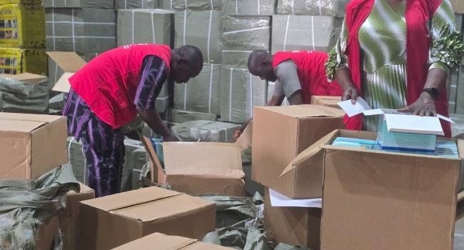

# 💊 Fake Drugs Detection via Pharmacy Sales

## 📌 Project Overview
Fake and substandard drugs pose a serious public health and economic threat.  
This project leverages **data analytics and anomaly detection models** to identify suspicious pharmacies, suppliers, and brands within pharmaceutical sales data.  

By analyzing pricing anomalies, sales patterns, expiry dates, and supplier behaviors, the system highlights entities most likely linked to fake or substandard drugs.  

---

## 🎯 Project Objectives
- **Primary Objective:**  
  Detect fake or substandard drugs in the supply chain using anomaly detection models and flag suspicious pharmacies, suppliers, or drug batches.

- **Secondary Objectives:**  
  - Engineer risk-based features (pricing anomalies, expiry dates, suspicious sales channels).  
  - Provide a dashboard for stakeholders to visualize patterns and support decision-making.  

---

## 📊 Data Insights
- **Price & Supplier Patterns**  
  - Brands show similar median prices but wide variability with extreme outliers.  
  - A few suppliers dominate sales, e.g., *Jones Inc.*  

- **Location & Brand Insights**  
  - Urban and rural transactions are nearly balanced.  
  - Rare brands, especially “Unknown,” present higher fraud risk.  

- **Risk Scores**  
  - Some pharmacies (e.g., *Gruzman, Hoffman & Baldwin Pharmacy*) and suppliers (*Russell Group, Mortion-Chase*) consistently show higher risk.  

---

## 🤖 Anomaly Detection
Three unsupervised models were applied:  
- **Isolation Forest**  
- **Local Outlier Factor (LOF)**  
- **One-Class SVM**  
- **Ensemble Majority Vote** to reduce false positives.  

🚩 Flagged pharmacies, suppliers, and brands were ranked by **risk score** and frequency of anomalies.  

---

## 📌 Real Life Case (Lagos, Nigeria)
In **September 2025**, NAFDAC seized **₦1.2 billion worth of fake malaria drugs** in Lagos.  
This real-world case illustrates the critical need for stronger drug-monitoring systems like the one developed in this project.  

📷 *Example seizure by NAFDAC (Channels TV, 2025)*  

  

---

## 📈 Dashboard Highlights
- Top 10 Suspicious Pharmacies & Suppliers  
- Pharmacies selling at unusually low prices  
- High-risk brands flagged  
- Near-expiry vs. normal drugs (31% near expiry)  

---

## ✅ Recommendations
- **Short-term:**  
  - Enforce strict checks on near-expiry & discounted drugs.  
  - Monitor high-risk pharmacies & suppliers.  
  - Educate consumers on identifying suspicious brands.  

- **Long-term:**  
  - Implement a **centralized drug-tracking system**.  
  - Strengthen supplier verification policies.  
  - Integrate **AI-powered anomaly detection** into national monitoring.  

---

## 📅 Implementation Plan
- **0–3 months:** Deploy anomaly detection dashboard in pilot pharmacies.  
- **3–6 months:** Targeted inspections for flagged suppliers/pharmacies.  
- **6–12 months:** Launch consumer awareness campaigns.  
- **1–2 years:** National rollout of drug traceability system.  

---

## 📌 Key Takeaways
- Fake drugs threaten public health, economic stability, and trust in healthcare.  
- Anomaly detection provides **early warning signals** for suspicious suppliers and pharmacies.  
- Data-driven monitoring + regulatory enforcement = **safer drug supply chains**.  

---

## 📚 References
- Channels TV – [NAFDAC Seizes ₦1.2bn Worth Of Fake Drugs In Lagos](https://www.channelstv.com/2025/09/12/photos-nafdac-seizes-%E2%82%A61-2bn-worth-of-fake-drugs-in-lagos/?utm_source=chatgpt.com)  
- Think Global Health – [Nigeria’s Counterfeit Drug Epidemic](https://www.thinkglobalhealth.org/article/nigerias-counterfeit-drug-epidemic?utm_source=chatgpt.com)  
