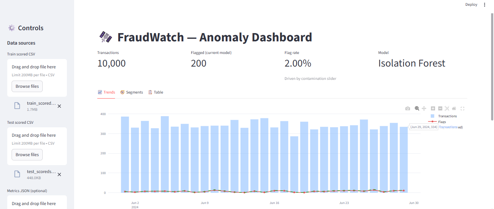
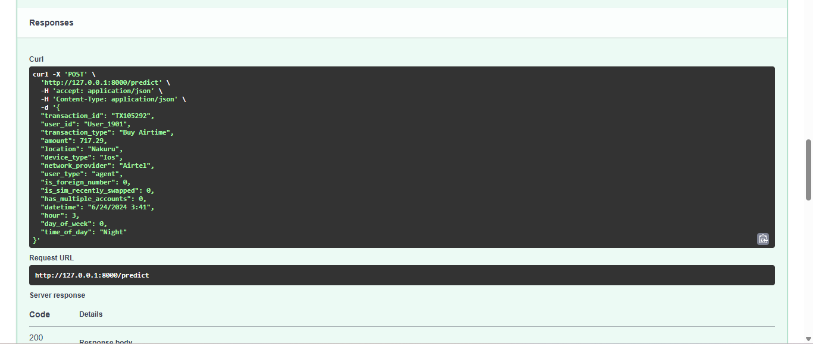
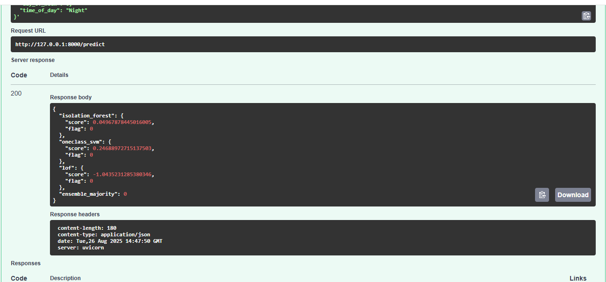

# 📊 Fraud Detection in Mobile Money Transactions

This project was completed as part of my **DataVerse Africa Internship**. It focuses on detecting fraudulent transactions in mobile money platforms using **unsupervised anomaly detection models**, with deployment through **Streamlit dashboards** and a **FastAPI endpoint**.

---

## 🚨 Problem Statement
- **Context**: Mobile money services are key to financial inclusion in Africa, allowing millions to access digital payments.  
- **Issue**: These platforms are vulnerable to fraud such as **SIM swaps, foreign number use, and unusually high-value transactions**.  
- **Impact**: Fraud erodes trust, causes financial losses, and increases compliance risks. Early detection is critical.

---

## 🎯 Project Objectives
- **Primary Objective**: Detect potentially fraudulent transactions in mobile money platforms using **unsupervised anomaly detection models**.  
- **Secondary Objectives**:  
  - Engineer features that capture user behavior and risk factors.  
  - Compare performance across different anomaly detection models.  
  - Build a **Streamlit dashboard** for visualization.  
  - Deploy a **FastAPI endpoint** for integration.  

---

## 📑 Methodology
1. **Data Cleaning**  
2. **Feature Engineering** (user-level and risk-based features)  
3. **Preprocessing & Scaling**  
4. **Model Development**  
   - Isolation Forest  
   - Local Outlier Factor (LOF)  
   - One-Class SVM  
   - Ensemble Majority Voting  
5. **Deployment**  
   - **Streamlit dashboard** for visualization  
   - **FastAPI endpoint** for prediction  

---

## 🔎 Exploratory Data Analysis
- Transactions were spread across multiple **locations, times of day, and transaction types**.  
- Certain **locations and time periods (nighttime)** showed higher suspicious activity.  
- Risk-related flags (e.g., SIM swaps, foreign numbers) provided useful engineered features.  

---

## 🤖 Model Insights
- At contamination rate of 2%:  
  - **Isolation Forest** flagged ~200 transactions (2%), most in **Mombasa**.  
  - **Local Outlier Factor (LOF)** flagged ~200 transactions (2%), most in **Eldoret**.  
  - **One-Class SVM** flagged ~200 transactions (2%), most in **Nyeri**.  
  - **Ensemble Majority Voting** flagged 162 transactions (1.62%), most in **Eldoret**.  

➡ Fraud-like behavior clustered around **specific locations** and **night-time transactions**.

---

## 📉 Limitations
- Dataset only spans **1 month**, limiting long-term pattern detection.  
- **No labeled fraud cases** → evaluation limited to anomaly detection.  
- Feature engineering was **basic** and may miss subtle fraud signals.  
- Hard to evaluate trade-off between **false positives vs false negatives**.  

---

## ✅ Recommendations
- **Short-Term**:  
  - Integrate anomaly detection alerts into fraud-monitoring workflows.  
  - Prioritize **manual review** of flagged transactions in high-risk locations.  
- **Long-Term**:  
  - Collect and label real fraud cases for **supervised learning**.  
  - Deploy fraud detection API into **live transaction pipelines**.  
  - Continuously tune thresholds to balance detection accuracy.  

---

## 🚀 Implementation Plan
- **Timeline**:  
  - Phase 1 → Feature engineering + baseline models.  
  - Phase 2 → Dashboard & API deployment.  
  - Phase 3 → Real-time integration & stakeholder training.  
- **Resources Required**:  
  - Cloud infrastructure, skilled data engineers, fraud analysts.  
- **Key Stakeholders**:  
  - Fraud risk management team.  
  - Technology/engineering department.  
  - Compliance and audit teams.  

---

## 📊 Dashboard Preview
Streamlit dashboard for monitoring suspicious transactions.  

  

---

## ⚡ FastAPI Deployment
The API exposes a `/predict` endpoint where transaction details can be submitted for fraud risk scoring.  

**Swagger UI Test – Supplying Transaction Data**  
  

**Swagger UI Test – Prediction Response**  
  

---

## 🏁 Conclusion
This project demonstrates that **unsupervised learning** can be applied to fraud detection in mobile money systems. It provides **real-time, scalable, and cost-effective monitoring** that strengthens trust in Africa’s digital financial ecosystem.

---

👨‍💻 *Developed during my DataVerse Africa Internship*
