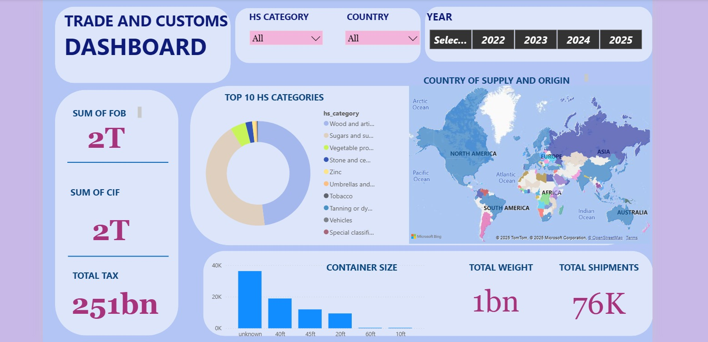

# 📊 Trade and Customs Analytics Project  

## 📌 Project Overview  
In many developing economies, customs administrations face challenges in optimizing revenue collection due to limited visibility into **trade patterns, importer behavior, and tax efficiency**.  

This project leverages **data analytics** to uncover under-taxed imports, detect inconsistencies in valuation, and evaluate the performance of customs offices and import categories.  

The ultimate goal is to help governments **reduce revenue leakage**, strengthen tax policy, and improve customs decision-making.  

---

## 🎯 Objectives  
- Analyze trade and customs data to generate actionable insights.  
- Identify **top and low-performing HS categories**.  
- Detect **import value and tax mismatches**.  
- Uncover **seasonal and country-based trade patterns**.  
- Assess **logistics performance** (mass, containers, etc.).  
- Provide **evidence-based policy recommendations**.  

---

## 📂 Dataset  
The project uses customs trade records, including:  
- HS Categories  
- Import Volumes & Values  
- Tax Revenue Data  
- Country of Origin Information  
- Logistics (mass, containers, CIF values, etc.)  

---

## 🔍 Key Insights  
- **Top HS Categories by Tax Revenue** → Certain goods contribute significantly to revenue, while others remain under-taxed.  
- **Country Trends** → Imports from countries like Luxembourg, Thailand, and India revealed suspiciously low tax-to-value ratios.  
- **Seasonal Patterns** → Monthly trade volumes highlighted fluctuations, useful for forecasting.  
- **Revenue Gaps** → Several HS codes showed mismatches between declared values and expected benchmarks.  

---

## 📊 Dashboard Preview  
An interactive dashboard was developed to visualize:  
- Top HS categories by revenue  
- Import volumes by country  
- Monthly trade volumes  
- High-risk under-taxed categories  

  

---

## ✅ Recommendations  
**Short-Term**  
1. Optimize tax policy for under-taxed HS categories.  
2. Scrutinize imports from high-risk countries.  

**Long-Term**  
3. Invest in **digital customs infrastructure** (AI/ML for real-time monitoring).  
4. Strengthen **public-private collaboration** with importers and brokers.  

---

## 🛠️ Implementation Plan  
- **Phase 1 – Policy Review (Months 1–2):** Review HS codes, set benchmark pricing.  
- **Phase 2 – Technology Deployment (Months 3–4):** Implement AI/ML monitoring tools.  
- **Phase 3 – Pilot Testing (Months 5–6):** Test policies in selected customs offices.  
- **Phase 4 – Full Rollout (Months 7–9):** Nationwide implementation and training.  

---

## 📌 Conclusion  
This project demonstrated how **data-driven analytics can transform customs operations**. By identifying inefficiencies, uncovering risks, and providing targeted recommendations, the solution enhances **revenue assurance, policy effectiveness, and operational efficiency**.  

---

🔗 **Internship Project under DataVerse Africa**  
